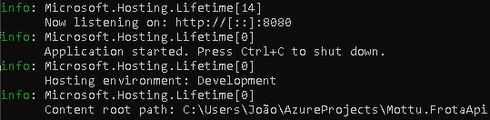
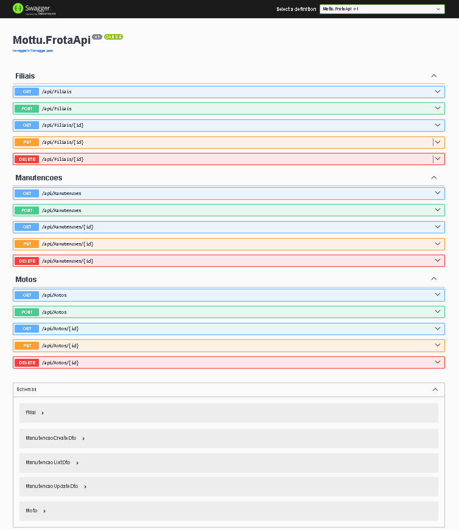
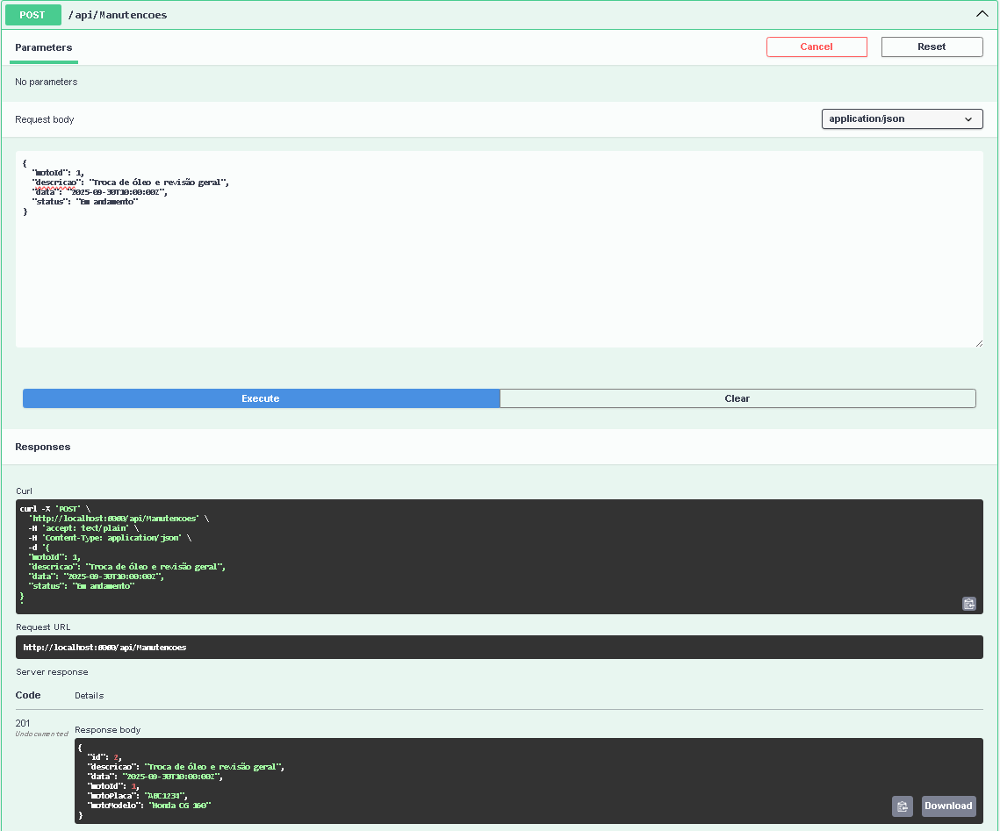
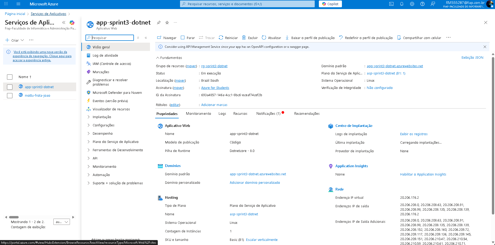

Mottu Frota API – Sprint 3

API RESTful para gerenciamento de motos, filiais e manutenções, desenvolvida em .NET 8, com documentação Swagger/OpenAPI e HATEOAS implementado.

1) Integrantes

Marcelo Scoleso

João Santis

João Paulo

2) Justificativa da Arquitetura

A API segue o modelo RESTful, utilizando Controllers para cada entidade (Motos, Filiais, Manutencoes) com endpoints CRUD completos.

Principais escolhas arquiteturais:

.NET Web API: framework robusto e consolidado para APIs REST.

Entity Framework Core: persistência de dados e gerenciamento de relacionamentos.

HATEOAS: links de navegação para facilitar consumo e descoberta de recursos.

Swagger/OpenAPI: documentação interativa com exemplos de payloads.

Essa arquitetura garante manutenção fácil, escalabilidade e clareza na comunicação entre o front-end e a API.

3) Tecnologias Utilizadas

.NET 8

ASP.NET Core Web API

Entity Framework Core

Swagger/OpenAPI

Newtonsoft.Json

4) Estrutura do Projeto
Mottu.FrotaApi/
├── Controllers/
│   ├── MotosController.cs
│   ├── FiliaisController.cs
│   └── ManutencoesController.cs
├── Data/
│   └── AppDbContext.cs
├── Models/
│   ├── Moto.cs
│   ├── Filial.cs
│   └── Manutencao.cs
├── Program.cs
└── README.md

5) Instruções de Execução

Clonar o repositório:

git clone https://github.com/MarceloScoleso/Mottu.FrotaApi.git
cd Mottu.FrotaApi

Restaurar pacotes e construir o projeto:

dotnet restore
dotnet build

Executar a API:

dotnet run

Acessar o Swagger UI:

https://localhost:5001/swagger

6) Endpoints
Entidade	Método	Rota	Descrição
Motos	GET	/api/Motos	Lista motos (com paginação)
Motos	GET	/api/Motos/{id}	Obter moto por ID
Motos	POST	/api/Motos	Criar nova moto
Motos	PUT	/api/Motos/{id}	Atualizar moto existente
Motos	DELETE	/api/Motos/{id}	Deletar moto
Filiais	GET	/api/Filiais	Lista filiais
Filiais	GET	/api/Filiais/{id}	Obter filial por ID
Filiais	POST	/api/Filiais	Criar nova filial
Filiais	PUT	/api/Filiais/{id}	Atualizar filial existente
Filiais	DELETE	/api/Filiais/{id}	Deletar filial
Manutenções	GET	/api/Manutencoes	Lista manutenções
Manutenções	GET	/api/Manutencoes/{id}	Obter manutenção por ID
Manutenções	POST	/api/Manutencoes	Criar nova manutenção
Manutenções	PUT	/api/Manutencoes/{id}	Atualizar manutenção
Manutenções	DELETE	/api/Manutencoes/{id}	Deletar manutenção
7) Exemplos de Uso
Listar motos com paginação e HATEOAS
GET /api/Motos?page=1&pageSize=10

Resposta exemplo:

{
  "totalItems": 25,
  "page": 1,
  "pageSize": 10,
  "totalPages": 3,
  "data": [
    {
      "id": 1,
      "placa": "ABC-1234",
      "modelo": "Honda CG 160",
      "status": "Disponível",
      "filial": {
        "id": 1,
        "nome": "Filial Central"
      },
      "links": [
        { "rel": "self", "href": "/api/Motos/1" },
        { "rel": "update", "href": "/api/Motos/1" },
        { "rel": "delete", "href": "/api/Motos/1" }
      ]
    }
  ],
  "links": [
    { "rel": "self", "href": "/api/Motos?page=1&pageSize=10" },
    { "rel": "next", "href": "/api/Motos?page=2&pageSize=10" },
    { "rel": "prev", "href": null }
  ]
}

Criar uma nova moto
POST /api/Motos

Payload exemplo:

{
  "placa": "XYZ-9876",
  "modelo": "Honda CB 500",
  "status": "Disponível",
  "filialId": 1
}

Resposta: 201 Created com o objeto criado.

8) Requisitos Atendidos

✅ CRUD completo para Motos, Filiais e Manutenções
✅ Implementação de HATEOAS
✅ Documentação com Swagger/OpenAPI
✅ Deploy no Azure App Service (Linux)
✅ Conexão com banco de dados via Entity Framework Core

9) Deploy no Azure

A API está publicada no Azure App Service:

https://app-sprint3-dotnet.azurewebsites.net/swagger

10) Banco de Dados

Foi utilizado Entity Framework Core com suporte a SQL Server.
O contexto da aplicação está definido em AppDbContext.cs.

11) Considerações de Segurança

Uso de HTTPS obrigatório.

CORS habilitado apenas para domínios confiáveis.

Tratamento centralizado de erros no ApiControllerBase.

12) Próximos Passos

Adicionar autenticação com JWT.

Criar testes automatizados com xUnit.

Implementar CI/CD no Azure DevOps.

13)Evidências da Implementação

Aplicação rodando localmente

Swagger carregado

Endpoint GET funcionando

Endpoint POST funcionando

Deploy no Azure

14) Conclusão

O projeto entrega todos os requisitos da Sprint 3 com sucesso, garantindo funcionalidade, organização de código, documentação clara e deploy no Azure.